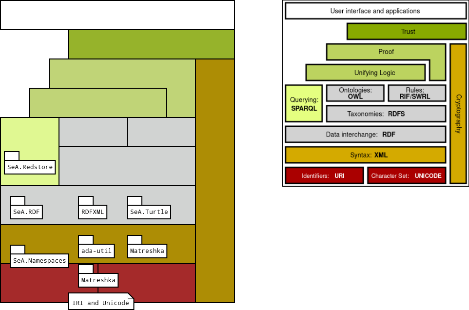
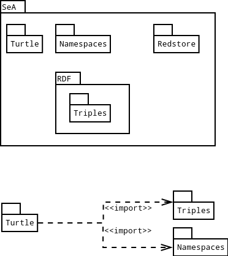

# Table of Contents

1.  [SeA](#org284f875)
2.  [Libraries and packages](#orgc498390)
3.  [Compiling](#org2b8f872)
    1.  [With GPRBuild](#orgeca7a91)
4.  [Usage](#orgb9e0bad)
5.  [License](#orgcd79205)

# SeA

SeA are Ada libraries for the Semantic Web

 

# Libraries and packages

See imgs/README.md for the Semantic Web stack image copyright.

SeA are divided in the following packages:

# Compiling

All SeA subpackage follows the usual procedure.

The requirements are

-   the Ada GNAT compiler
-   the GPRBuild tools
-   the [Matreshka library](https://forge.ada-ru.org/matreshka)
-   the [ada-utils library](https://github.com/stcarrez/ada-util/)

The usual sequence may work for your environment:

    make
    make install

The Makefile can be configure at the makefile.setup file. This file can be generated with the following command:

    make setup

## With GPRBuild

Use the following commands to compile:

    gprbuild -PSeA.gpr -p

To install the library and binaries:

    gprinstall -PSeA.gpr -p

A install directory can be specified by the `--prefix` parameter:

    gprinstall -PSeA.gpr --prefix=/home/USERNAME/Ada -p

# Usage

The API specification are available as `*.ads` files. 

Librares can be used by importing the GPR file into your GPR. For instance, the SeA-turtle imports the SeA-common libraries on their `turtle_lib.gpr` with the following sentence:

Main programs were created for debuging purposes. They usually are `src/binaries/*.adb` source files and they are specified inside the `PROJECTNAME_binaries.gpr` file at the `Main` variable.
These programs are used to test and debug the libraries. They can be used as examples.

# License

This work is under the General Public License version 3.

